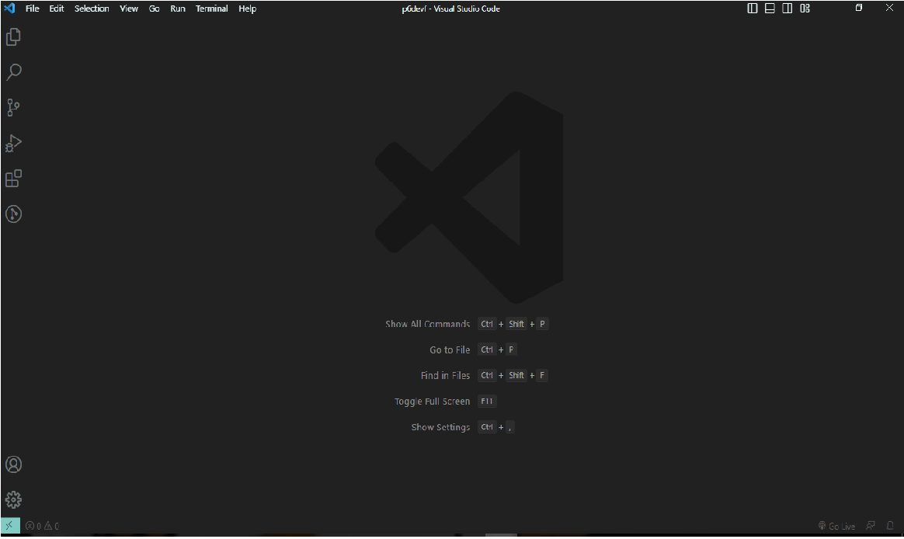
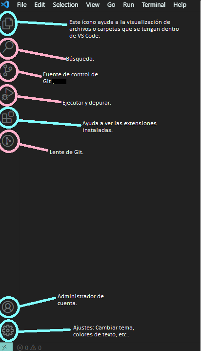
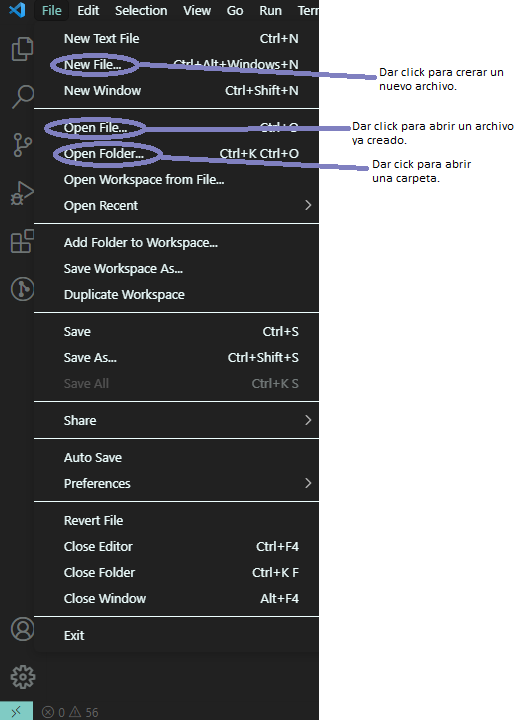
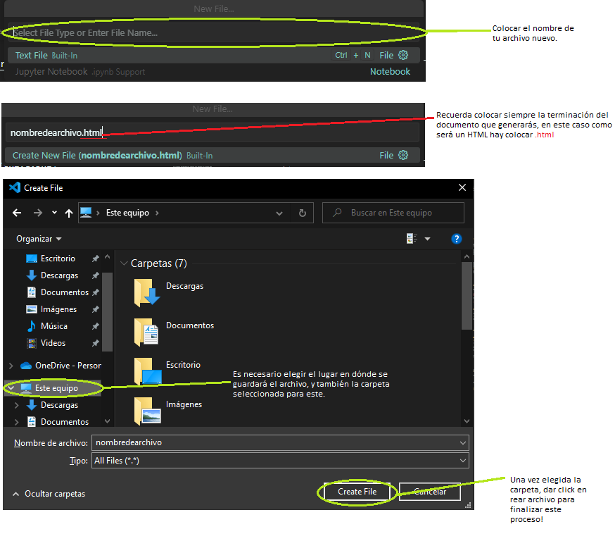
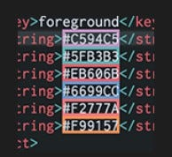
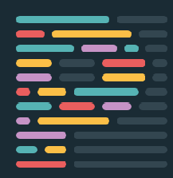

# Visual Studio Code (VS Code).

## ¿Qué es?

VS Code, es un editor de código (HTML, Java Script, JSON'S, entre otros) fuente desarrollado por Microsoft. Este editor de código está disponible para Windows, GNU/Linux y macOS.

Entre sus características más destacables se encuentra un soporte para depuración, resaltado de sintaxis, compilador de código inteligente, refactorización de código, Git integrado y extenciones que facilitan su uso y comprensión, entre otros.

---

## ¿Por qué lo vamos a utilizar?

Como ya es notorio, este programa aparte de ser uno de los más utilizados actualmente, cuenta con muchas prácticas que facilitan su uso, tales como las extemnsiones, integración con otros programas, personalización de tu editor, autocompletado, entre otros más.

Por ello es bueno iniciar con este software ya que es bastante completo y sencillo de utilizar si eres aún principiante o inclusive ya alguien con experiencia previa.

---

## ¿Cómo puedo descargar VS Code?

### Windows

1. Descarga Visual Studio Code desde el siguiente link: https://code.visualstudio.com/Download .

2. Una vez descargado, ejecute el instalador (VSCodeUserSetup-{version}.exe).

3. De manera predeterminada, VS Code se instala en C:\Users\_{Username}\AppData\Local\Programs\Microsoft VS Code.

4. Es necesario conceder los permisos necesarios para una mejor experiencia.

(Hacer los mismo con los pasos para Mac y Linux)

---

## ¿Qué es lo que veo? (Interfaz de VS Code).

Una vez instalado VS Code, es de suma reelevancia conocer su interfaz y página de inicio.

Si bien, puede haber dos pantallas de inicio en CS Code.

Si bien a pesar de cualquier inicio que se visualice, es necesario conocer la interfaz o menú de apoyo que se encuentra del lado izquierdo de tu pantalla.

---

## ¿Cómo crear y guardar archivos?

Para poder crear y guardar un archivo; deberás ir a la parte superior izquierda de tu VS Code y dar click en la palabra.

> File o Archivo.

Según el idioma en que se encuentre configurado tu VSCode.
Aquí un apoyo visual.

---

Una vez dado click aparecerá un menú parecido a este.

En esta ocasión solo utilizaremos el apartado

> Crear nuevo archivo o new file.

Al dar click en este, deberás nombrar tu archivo con la terminación **.html**. Una vez realizado hay que colocar ese archivo en un lugar y carpeta específicos.

Ejemplo gráfico.

---

## Extensiones de VS Code.

### ¿Que son?

Una extensión es un agregado que permite compartir contenido o eventos de implementación con una aplicación. Estas son utilizadas para mejorar la experiencia al utilizar una app o algún sitio.

#### _Aquí hay algunas extensiones que te sugerimos ya que pueden ser útiles para tí como principiante._

1. **Live Server**

Esta es una herramienta que te ayuda a previsualizar en el navegador los cambios que se están realizando en tiempo real.

Esta previsualización se actualiza inmediatamente al guardar el proyecto desde el editor, en este caso VS Code.

[Da click aquí para descargar Live Server](https://marketplace.visualstudio.com/items?itemName=ritwickdey.LiveServer)

2.  **Color highlight**

Herramienta que ayuda a visualizar en el código, sugerencias de colores así como los colores que hemos utilizado.

Como se conocerá más adelanate del curso en HTML se utilizan colores en formato _hexagesimal_ lo cuál puede llegar a dificultar la identificación de estos, por ello esta herramienta es útil.

[Da click para descargar Color Hightlight](https://marketplace.visualstudio.com/items?itemName=naumovs.color-highlight)

1.  **Prettier**

Herramienta que da diseño a el formato del código que estamos escribiendo con colores, para facilitar la identificación de etiquetas, atributos, errores, entre otros.

[Da click para descargar Prettier](https://marketplace.visualstudio.com/items?itemName=esbenp.prettier-vscode)

1.  **Auto Close Tag**

Herramienta que te ayuda a cerrar una etiqueta en automático.

[Da click para descargar Auto Close Tag](https://marketplace.visualstudio.com/items?itemName=formulahendry.auto-close-tag)

---
